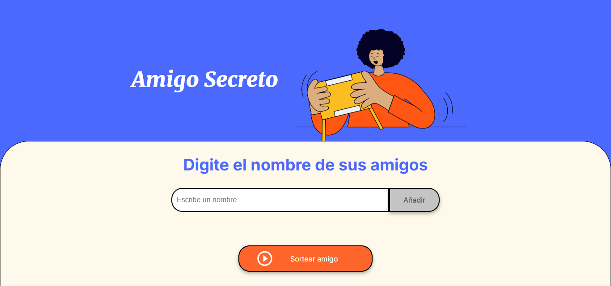
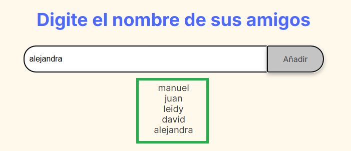
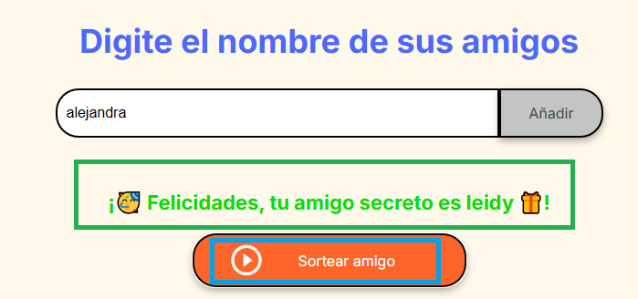

# Desafio Amigo Secreto

En este desafío, se desarrolla una aplicación que permite a los usuarios ingresar nombres de amigos en una lista para luego realizar un sorteo aleatorio y determinar quién es el "amigo secreto".

El usuario deberá agregar nombres mediante un `campo de texto` y un botón `Adicionar`. Los nombres ingresados se mostrarán en una lista visible en la página, y al finalizar, un botón `Sortear Amigo` seleccionará uno de los nombres de forma aleatoria, mostrando el resultado en pantalla.

## Fucionalidades:

- Agregar nombres: Los usuarios escribirán el nombre de un amigo en un campo de texto y lo agregarán a una lista visible al hacer clic en "Adicionar".

- Validar entrada: Si el campo de texto está vacío, el programa mostrará una alerta pidiendo un nombre válido.

- Visualizar la lista: Los nombres ingresados aparecerán en una lista debajo del campo de entrada.

- Sorteo aleatorio: Al hacer clic en el botón "Sortear Amigo", se seleccionará aleatoriamente un nombre de la lista y se mostrará en la página.

## Dependencias/Instalación:

Para utilizar esta página web solo se necesita tener un navegador web 🌐 como Chrome o Microsoft Edge.

## En caso de errores:

En caso de errores, se recomienda cargar nuevamente la pagina web.

## Para comenzar

El propósito de este desafío es poner en práctica los conceptos adquiridos sobre lógica de programación. Para ello, se ha proporcionado el código HTML y CSS, lo que permitirá que el enfoque se centre completamente en aspectos fundamentales sobre lógica de programación como variables, condicionales, funciones y listas, entre otros.

El proyecto se compone de tres archivos: index.html, que contiene la estructura general de la aplicación (pagina web); style.css, que contiene los comandos para configurar visualmente nuestro archivo index.html; app.js, que esta escrito en lenguaje JavaScript y donde se configura la funcionalidad de la aplicación.

Inicio: aplicación Amigo Secreto

La vista inicial muestra un título para la aplicación al lado de una imagen alusiva esta. Una sección más abajo hay un subtítulo que indica que en esa sección se deben ingresar los nombres que van a componer la lista de amigos. Para ingresar cada nombre se cuenta con un `input` donde se deben  escribir los nombres y al lado de este hay un `button`, para guardarlos en una variable tipo lista.

Elementos para ingresar nombres: input y button

En caso de que se trate de ingresar un nombre en blanco (vacío), se mostrará un `alert` indicando que se debe ingresar un nombre válido.

Alerta por nombre no válido

A medida que se ingresan nuevos nombres y estos se guardan en la variable tipo lista, un elemento html tipo lista no ordenada `ul` se actualiza con elementos html tipo lista `li`, donde se tiene uno por cada nombre ingresado.

Lista de nombres ingresados

Finalmente, para sortear un nombre, se da click en el `button` **Sortear amigo**, donde se muestra sobre este un mensaje con el nombre del amigo secreo. Este nombre es seleccionado de forma aleatoría del listado de nombres ingresado previamente

Resultado de nombre sorteado

## Programa ONE - Oracle Next Education

ONE es un programa de educación, y empleabilidad con el objetivo social de capacitar personas en tecnología y conectarlas con el mercado de trabajo a través de las empresas asociadas.

El curso es **100% virtual** y **totalmente gratis**, hecho para quien no tiene acceso a educación de calidad y desea transformar su realidad social.

Para mayor información visite [ONE - Oracle Next Education](https://www.oracle.com/co/education/oracle-next-education/)